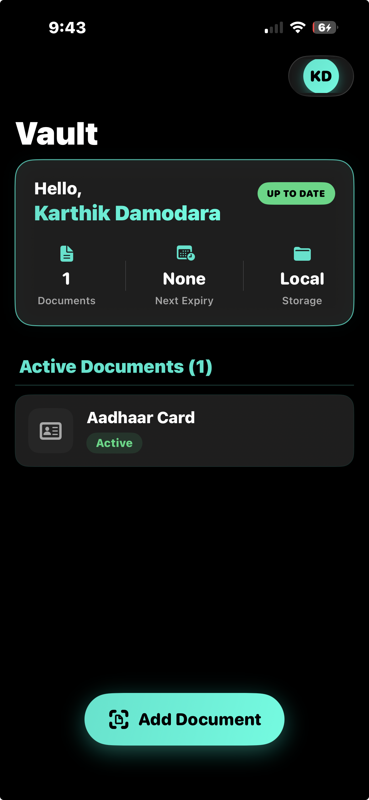
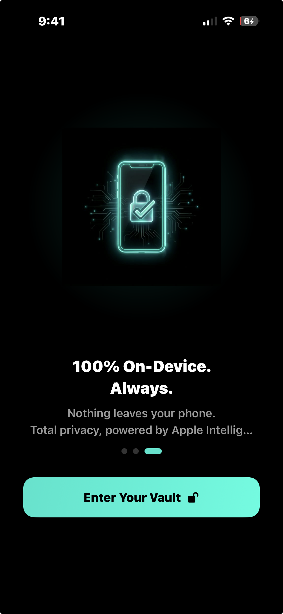
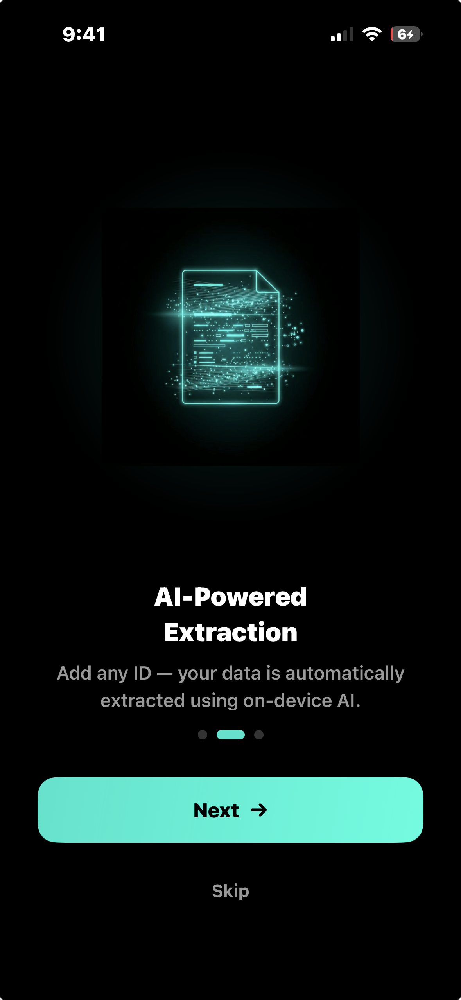
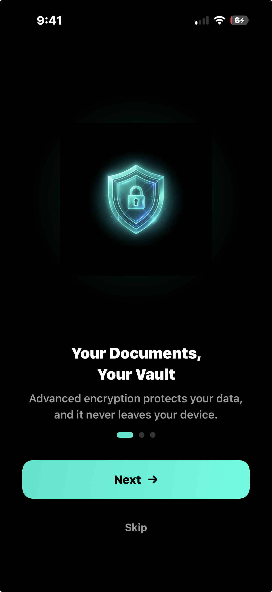
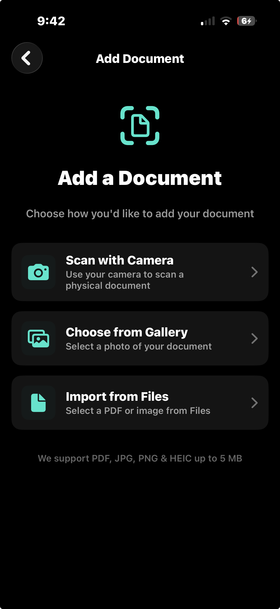
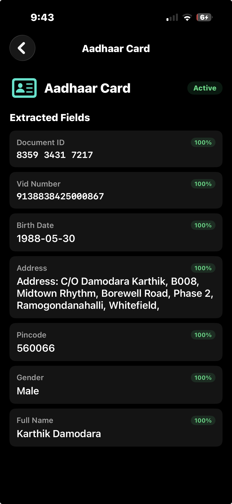
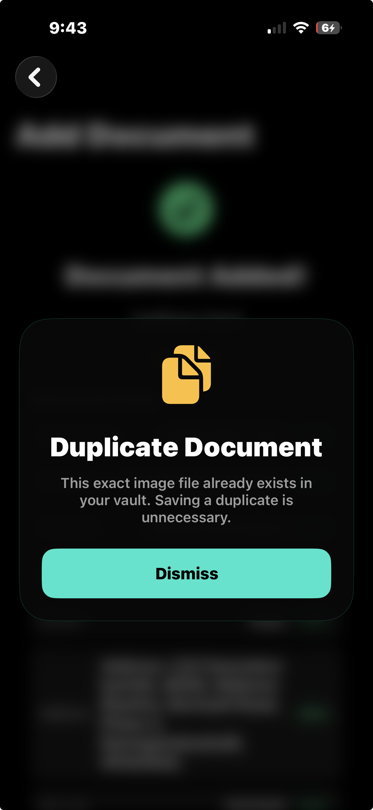
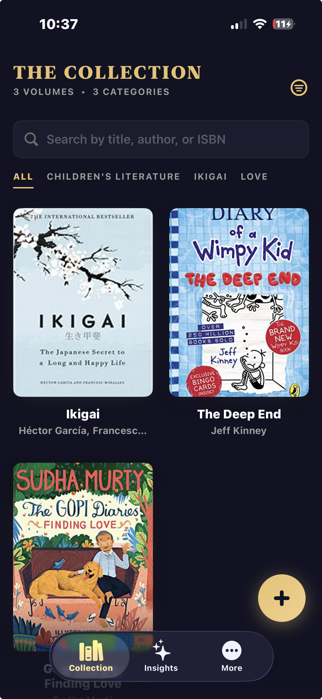
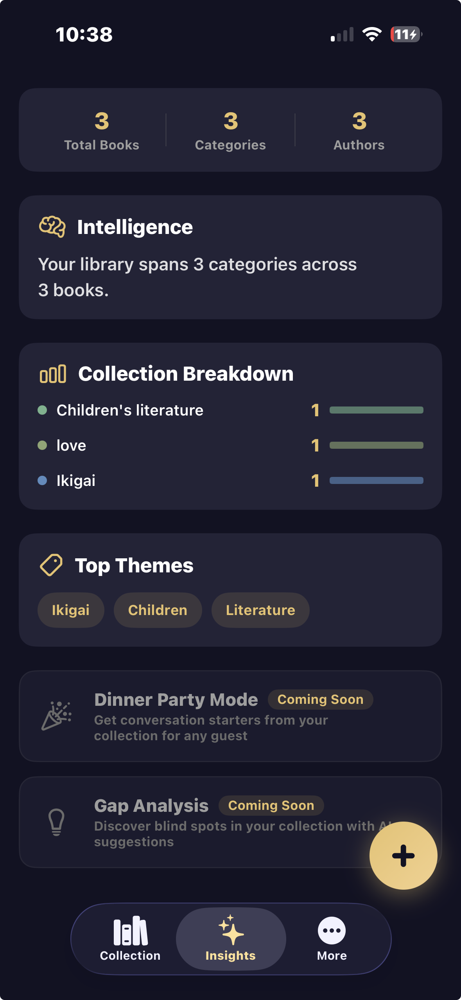
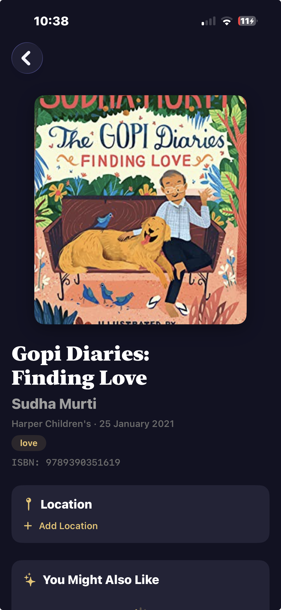

# Hi there 👋, I'm Karthik Damodara
**Senior iOS Engineer | Systems Architecture | Premium UX**

Welcome to my portfolio. Below, you will find architectural breakdowns of two of my core private applications. These highlight my approach to complex state management, local AI processing, and building premium, cinematic user interfaces.

---

### 💻 Featured Public Code
**🎬 Chaptr:** A high-performance iOS vertical video paging feed featuring a custom UIKit compositional engine, strict 3-player hardware memory limits, and zero-black-frame transitions. 
👉 [View the Code Repository](https://github.com/kada88/kada-chaptr) | 🍿 [Watch the Architecture Walkthrough](https://www.loom.com/share/e54f1ee3f9d34706a4ab1e40f71bdf90)

---

## 1. Memoria
**A Zero-Knowledge, On-Device AI Identity Concierge & Semantic Vault**

Memoria is a premium, privacy-first digital wallet that securely manages, structures, and reasons over personal identity documents using 100% local Apple Intelligence. It transforms unstructured document scans into a structured, queryable semantic vault without a single byte of personal data ever leaving the device.

### 🛠 Tech Stack & Architecture
* **Languages:** Swift (Strict Concurrency, iOS 18+)
* **UI Framework:** SwiftUI, Observation Framework
* **Local AI / ML:** FoundationModels, LanguageModelSession, Apple Intelligence (`@Generable`)
* **System Integration:** AppIntents, WidgetKit, Shortcuts, Share Extensions
* **Persistence:** GRDB (SQLite)
* **Architecture:** Layered Pipeline (L1 Ingestion → L2 Extraction → L3 Domain → L4 Persistence). MVVM-like state management driven by `@Observable` singletons (`AppEnvironment`).

### 🧠 Engineering Highlights
* **Zero-Knowledge Autonomous Utility (Local AI Agent):** Engineered a true "air-gapped" AI Agent running entirely on the iPhone's Neural Engine. Instead of risking data exposure or SQL hallucinations, the agent uses a constrained Observe-Orient-Decide-Act (OODA) loop. It reasons over user requests in natural language and triggers strict, type-safe Swift functions (`AppIntents`) as native tools to fetch data from the SQLite vault.
* **Hybrid Config-Driven & AI Extraction Pipeline:** Architected a resilient L2 Extraction Engine balancing raw speed with generative flexibility. Standardized documents are parsed via a deterministic `DocumentConfig` waterfall (regex, MRZ parsing) in ~2ms. For highly variable state-issued documents, the system dynamically falls back to zero-shot extraction, leveraging the iOS 18 `@Generable` macro to force the LLM to populate strongly-typed Swift structs, completely eliminating JSON hallucination crashes.
* **Advanced Identity Resolution & Document Lifecycle Engine:** Built a complex L3 Domain layer (`MemoriaEngine`) that cross-references OCR text, barcodes, and MRZ data for automated identity anchoring. It merges semantic overlaps, detects exact file duplicates, tracks expiration lifecycles, and gracefully defers ambiguous cases to a Human-in-the-Loop (HITL) trigger system.

### ✨ Product & UX: Premium Trust Design
Memoria’s interface was explicitly designed to feel like a high-end, impenetrable vault while remaining accessible and dynamic.
* **Visual Excellence & Fluid Micro-Animations:** Utilized harmonious color palettes, fluid glassmorphism, and deep dark-mode support. Embedded subtle SwiftUI interactions to ensure the app feels responsive during intense OCR processing and AI extraction tasks.
* **Conversational Assistant:** Designed a persistent, native "Assistant Sheet" for seamless vault queries (e.g., *"What is my DL number?"*), utilizing instant trust-indicator UI elements to reinforce that computations are executing 100% locally.

### 📱 Visual Showcase

**The Onboarding Experience (Establishing Trust)**
| 100% On-Device | AI-Powered Extraction | Encrypted Vault |
| :---: | :---: | :---: |
|  |  |  |

**Core Application UI**
| Scanner & Ingestion | Document Detail View | Smart Duplicate Detection |
| :---: | :---: | :---: |
|  |  |  |

---

## 2. ShelfWise
**AI-Powered Luxury Library Concierge**

A bespoke, AI-powered digital concierge designed for ultra-high-net-worth individuals to seamlessly catalog, organize, and extract deep insights from their private physical book collections.

### 🛠 Tech Stack & Architecture
* **UI Framework:** SwiftUI
* **Architecture Pattern:** MVVM-C (Model-View-ViewModel-Coordinator)
* **Reactive Programming:** Combine
* **Persistence:** CoreData (Programmatic entity mapping)
* **External Integrations:** OpenAI API (LLM Enrichment), Google Books API, Open Library API
* **Device Frameworks:** AVFoundation (Barcode Scanning), Vision

### 🧠 Engineering Highlights
* **Scalable MVVM-C Architecture in SwiftUI:** Engineered a rigid Model-View-ViewModel-Coordinator architecture to completely decouple navigation logic from the UI layer. This allowed for complex, programmatic modal routing (e.g., smoothly dismissing camera modals while seamlessly pushing to manual search flows) without relying on fragile SwiftUI `NavigationLink` states.
* **Asynchronous AI Enrichment Pipeline:** Designed a robust background processing queue that listens for new physical book ingestions. It silently passes metadata through an OpenAI integration layer to generate bespoke summaries and personalized reading recommendations without blocking the main UI thread.
* **Multi-Tiered Fallback API Resolution:** Built a resilient data ingestion service that attempts primary resolution via the Google Books API. If a barcode scan misses or returns incomplete metadata, the service seamlessly cascades to the Open Library API to ensure flawless data integrity for obscure or rare volumes.
* **Clean Architecture Data Boundaries:** Maintained strict separation of concerns by utilizing Data Transfer Objects (DTOs) for network responses, which are manually mapped to programmatic Core Data entities before being published to the ViewModels via Combine pipelines.

### ✨ Product & Premium UX
ShelfWise diverges from standard iOS design paradigms to offer an elite, "stealth luxury" aesthetic inspired by high-end auction catalogs (like Sotheby's).
* **Ambient Lighting Engine:** Engineered a custom SwiftUI modifier that dynamically extracts the dominant colors of a book cover and casts a blurred, ambient drop-shadow behind it, simulating physical gallery lighting.
* **Dynamic "Exhibition" Layouts:** Replaced standard lists with bespoke layouts featuring custom typography tracking, heavy negative space, and glassmorphic floating search bars to emulate a private museum exhibition.
* **Intelligent Loading States:** Eradicated standard loading spinners in favor of contextual "Concierge" messaging (e.g., *"AI is currently analyzing this volume..."*) to maintain immersion during asynchronous network tasks.

### 📱 Visual Showcase
| The Archive (Main Grid) | Collection Insights | The Dossier (Book Details) |
| :---: | :---: | :---: |
|  |  |  |
